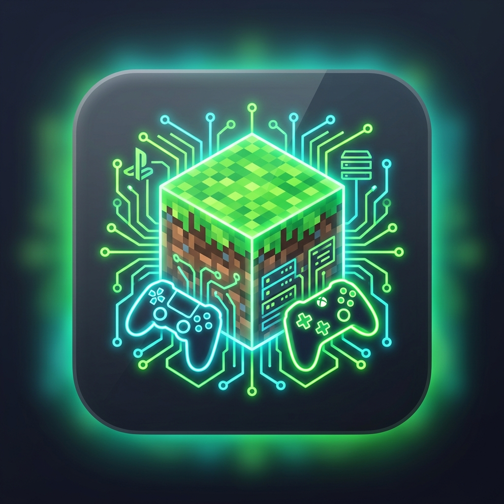

# Minecraft Server App 📱⚡ (Android & iOS)

> **Start your own Minecraft Java & Bedrock Crossplay SMP Server directly from your mobile phone — with a clean graphical app and ZERO terminal commands!**



[](https://github.com/Zcross091/Minecraft-Server-App/actions)

---

## 🌟 Why Use Minecraft Server App?

Hosting a Minecraft server traditionally required setting up command lines, terminal SSH prompts, complex Java flags, and manually downloading plugins. 

**Minecraft Server App** changes that by putting a complete, high-performance server controller directly into your pocket on **Android** and **iOS**!

---

## 🚀 Key Features

### 1. 📱 100% Terminal-Free Graphical UI
- No command-line knowledge required.
- Simple buttons to **Start**, **Stop**, and **Restart** your Minecraft server on demand.
- Live resource monitoring gauges for CPU %, Allocated RAM, and Online Players.

### 2. 📁 User-Selected Folder Storage
- Select or create any folder on your phone storage to store your server files (e.g., `/sdcard/Download/MinecraftServers/SMP` on Android or `Documents/MinecraftServers/SMP` on iOS).
- Default server name is automatically set to **`SMP`**.

### 3. ⚡ Pre-installed Core Crossplay & Version Compatibility
Every server created by the app comes **pre-configured and pre-installed** with essential crossplay requirements by default:
- 📱 **Geyser-Spigot**: Allows Bedrock Edition players (Android, iOS, Windows Bedrock, Xbox, PlayStation, Nintendo Switch) to join without needing Java Minecraft accounts.
- 🔑 **Floodgate-Spigot**: Enables passwordless, skin-synced authentication for Bedrock players.
- 🔄 **ViaVersion**: Preinstalled by default. Allows players on newer Minecraft versions (1.20.x+) to join.
- ⏮️ **ViaBackwards**: Preinstalled by default. Allows players on older Minecraft versions (1.8 – 1.19) to join.

### 4. 🧩 Custom Plugin, Mod & Addon Manager
- Easily search, install, and manage popular plugins (*BlueMap*, *Simple Voice Chat*, *GriefPrevention*, *LuckPerms*, *WorldEdit*, *Shopkeepers*).
- **Upload Custom Jars**: File picker to upload custom `.jar` or `.zip` plugin files from your phone into the server folder.
- Toggle switches to instantly enable or disable installed addons.

### 5. 🌐 Open to Public & Zero-Config Tunnels
- Opens ports for both **Java Edition (Port 25565)** and **Bedrock Edition (Port 19132)**.
- Integrated **Playit.gg Zero-Config Tunnel** domain support (`smp.joinmc.link`).
- One-click **"Copy Shareable Invite Message"** button to invite your friends instantly.

### 6. 💻 Dark Console & Interactive Log Stream
- Real-time dark-theme terminal log stream with color-coded syntax (`INFO`, `SUCCESS`, `NET`, `WARN`, `ERROR`, `SYSTEM`).
- Interactive command prompt to execute live server commands (`op <username>`, `say hello`, `list`, `stop`).

---

## 📥 How to Install the App

### 🤖 Android Setup (Download APK)

#### Option 1: Download Latest Release APK (Recommended)
1. Go to **[GitHub Releases Page](https://github.com/Zcross091/Minecraft-Server-App/releases)**.
2. Download **`SMP-Minecraft-Server-Android.apk`** from the Assets section.
3. Install the `.apk` file directly on your Android phone!


#### Option 2: Build from Source
```bash
cd "Minecarft Server android App"
npm install
npm run build
cd android
./gradlew assembleDebug
```

---

### 🍎 iOS Setup (iPhone & iPad)

#### Option 1: Open in Xcode (Mac)
1. Open the project in Xcode:
   `Minecraft Server ios App/ios/App/App.xcodeproj`
2. Connect your iPhone or iPad.
3. Press **Run** (`⌘R`) to install the native app!

#### Option 2: Download Build Artifacts
1. Go to **[GitHub Actions](https://github.com/Zcross091/Minecraft-Server-App/actions)**.
2. Download **`SMP-Minecraft-Server-iOS-Project`**.

---

## 📂 Repository Structure

```text
Minecraft-Server-App/
├── .github/workflows/
│   └── build_apps.yml             # Combined GitHub Actions CI/CD Workflow
├── Minecarft Server android App/   # Android Studio Project & Native Kotlin App
│   ├── android/                    # Native Android Gradle Project (MainActivity.kt, ServerEngineService.kt)
│   ├── src/                        # Dashboard UI & Engine Manager
│   └── package.json
├── Minecraft Server ios App/       # iOS Xcode Project & Native Swift App
│   ├── ios/                        # Native iOS Project (AppDelegate.swift, ViewController.swift, WKWebView Bridge)
│   ├── src/                        # Dashboard UI & Engine Manager
│   └── package.json
├── public/                         # App icon & global graphics
└── README.md                       # Unified Android & iOS Documentation
```

---

## 📄 License

Designed for Minecraft Crossplay SMP Community Server Management on Mobile Devices.
